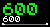
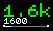
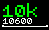

# Improved pedometer
Pedometer that filters out arm movement and displays a step goal progress.

I changed the step counting algorithm completely.
Now every step is counted when in status 'active', if the time difference between two steps is not too short or too long.
To get in 'active' mode, you have to reach the step threshold before the active timer runs out.
When you reach the step threshold, the steps needed to reach the threshold are counted as well.

## Screenshots
* 600 steps

* 1600 steps

* 10600 steps

## Features

* Two line display
* Large number for good readability
* Small number with the exact steps counted
* Large number is displayed in green when status is 'active'
* Progress bar for step goal (goal is currently hard-coded)
* Counts steps only if they are reached in a certain time
* Filters out steps where time between two steps is too long or too short
* Step detection sensitivity from firmware can be configured
* Steps are saved to a file and read-in at start (to not lose step progress)

## Variables to change step mesaurement configuration

* var stepThreshold = 30; //steps needed for threshold
* var stepGoal = 10000; //TODO: defne in settings
* const stepSensitivity = 80; //set step sensitivity (80 is standard, 400 is much less sensitive)
* var intervalResetActive = 30000; //interval for timer to reset active, in ms
* var timerResetActive = 80; //timer to reset active
* var stepTimeDiff = 9999; //Time difference between two steps
* const cMaxTime = 1100; // Max step duration (ms)
* const cMinTime = 240; // Min step duration (ms)

## Installation

* Open IDE https://www.espruino.com/ide/
* Copy & paste the code to the right side of the IDE
* Connect your watch
* Chose to store to flash
* Filename example: pedometer2.wid.js

## Requests

If you have any feature requests, please post in this forum thread: http://forum.espruino.com/conversations/345754/